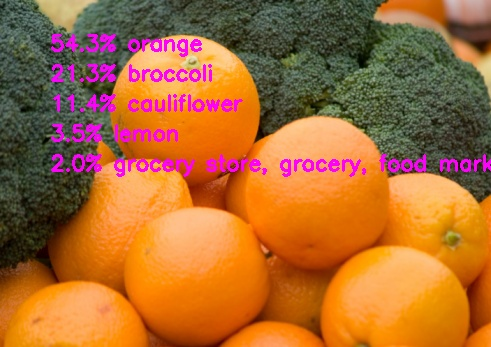
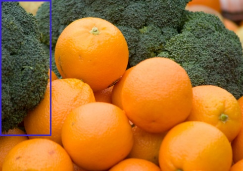
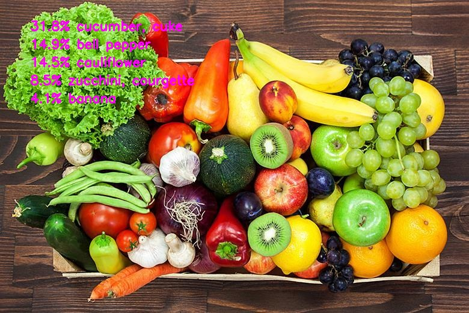
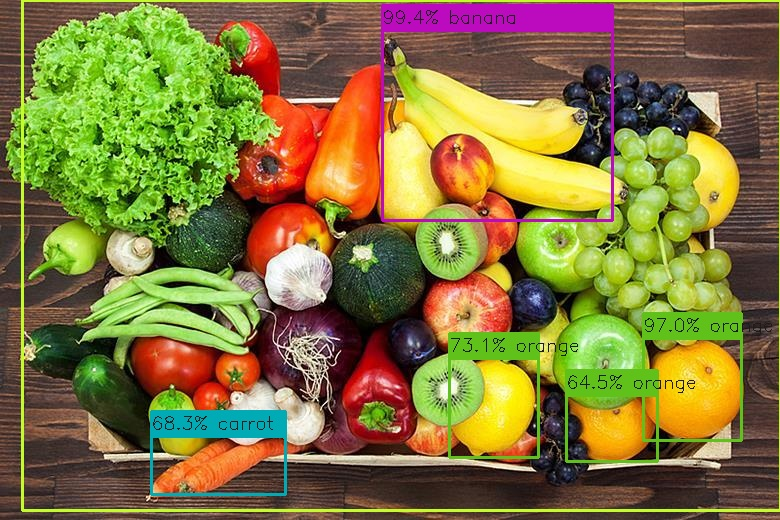
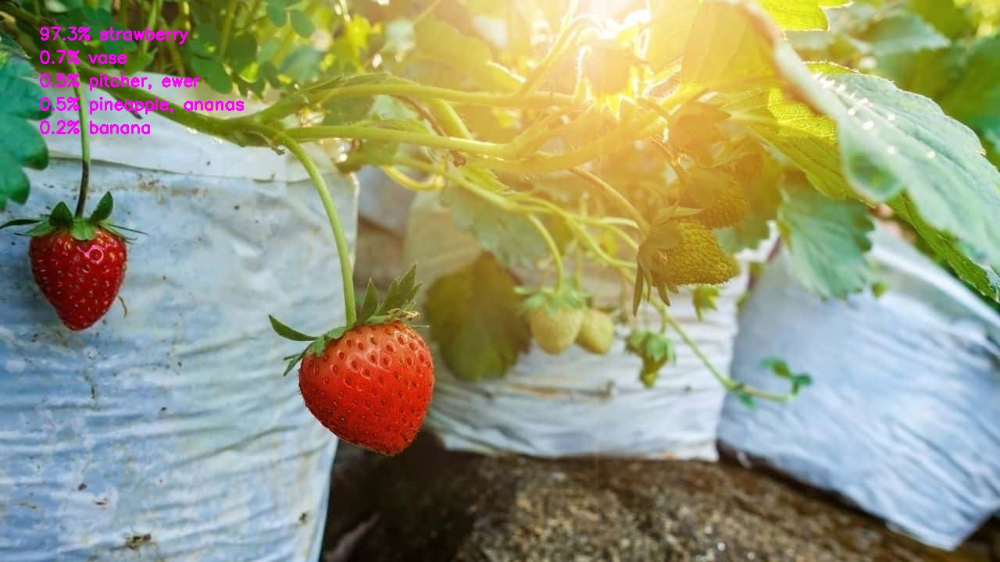
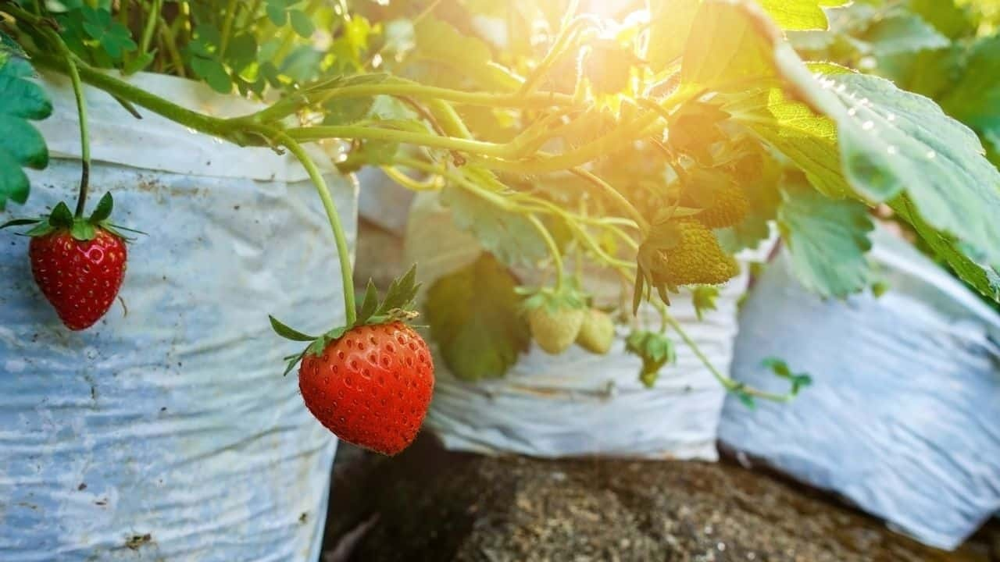
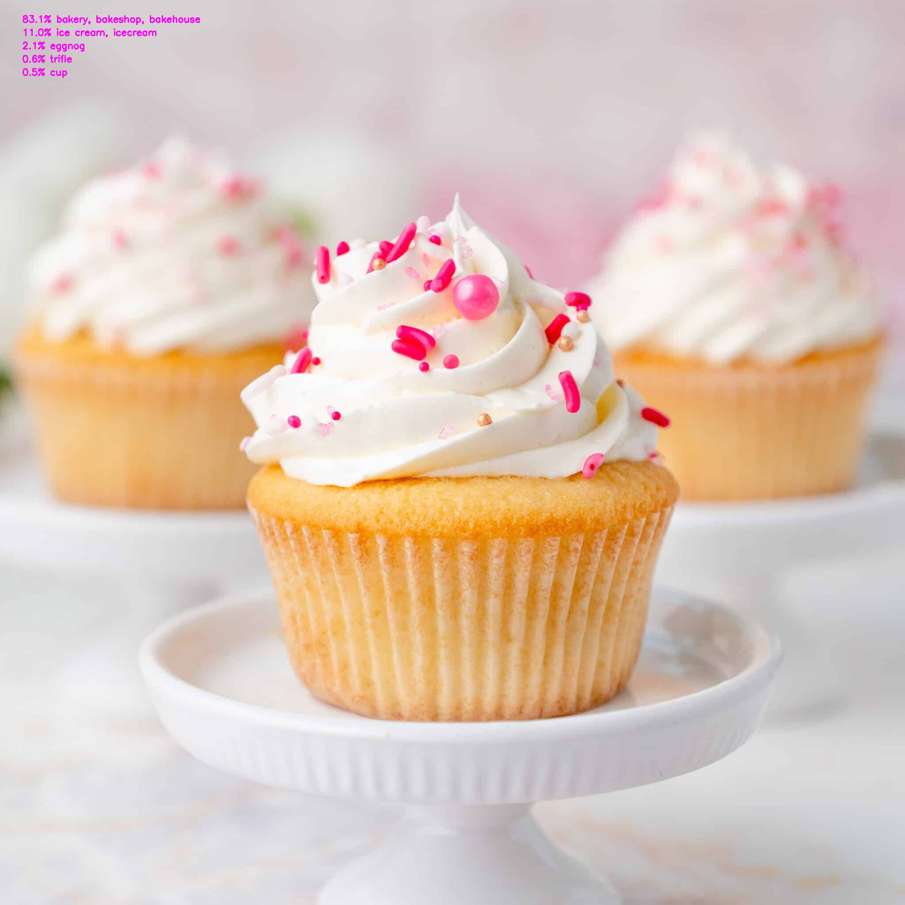
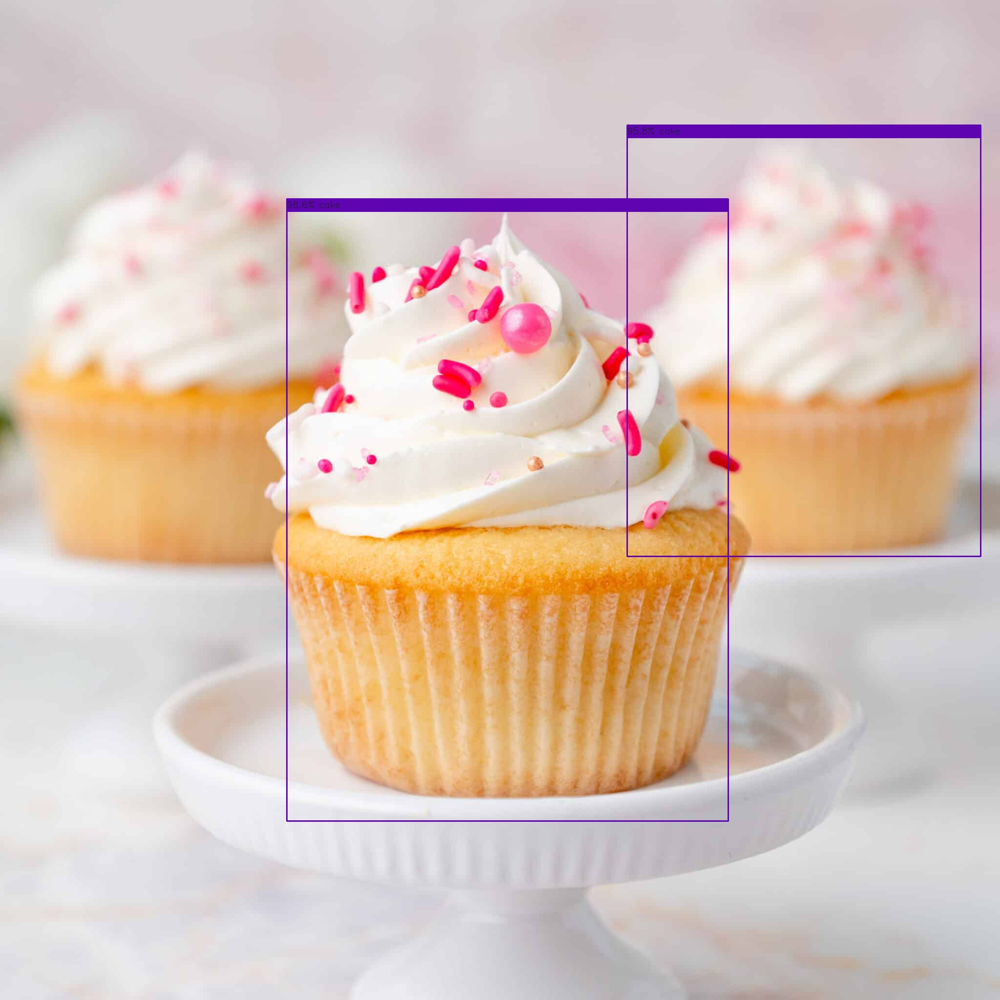
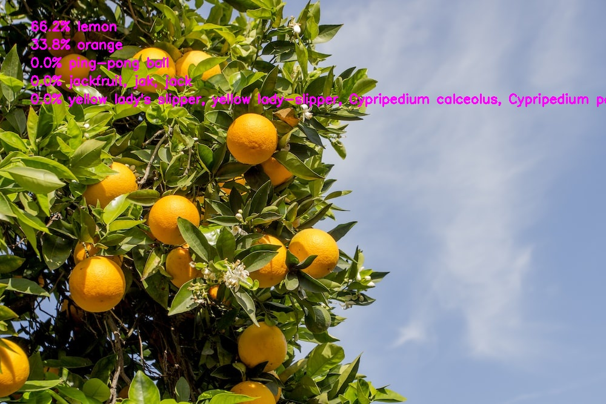
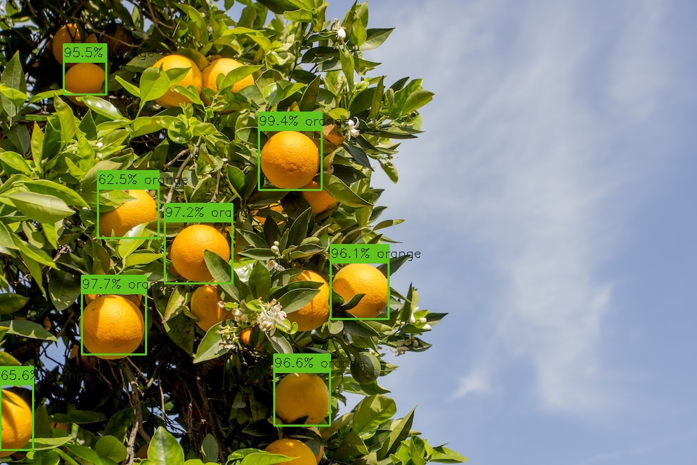

# Researching which OpenVINO model is best for identifying food items
## Finding models
We began by looking at the [OpenVINO model zoo](https://docs.openvino.ai/latest/omz_demos.html#doxid-omz-demos) and seeing which models were most suited for our needs and the needs of the client.  
We narrowed it down to two ResNet-50 and YoloV3.  

## Testing the models
Next we had to test the two models in order to decide which one we wanted to choose.  
For these test we prodominantly used the ImageNet labels for ResNet-50 and the COCO labels for the YoloV3. This is because though the ImageNet dataset is more robust, YoloV3 is much slower than ResNet-50 so it is impractical to use the larger dataset.  
We began by testing them using the two food related test images provided by our client.
The first of which is a photo of broccoli and oranges  
## Test 1
### ResNet-50
  
As you can see ResNet-50 correctly identifies the precence of orange and broccoli in the photo but fails to indicate in anyway where they are or how much there is, or even if they are both present in the photo.
### YoloV3
  
The Yolov3 on the other hand finds one of the heads of broccoli in the photo but misses the other two and fails to recognises the oranges altogether.
## Test 2
Next is a basket of a range of fruits and vegatables.  
### ResNet-50  
  
This is the sort of image where ResNet-50 main weakness comes to light. Though correctly identifying some of the items in the basket such as cucumber and bannana. It also identifies cauliflower which  is not present in this photo. The results we recevied arn't very useful as there is ditinguishment between the different foods.
### YoloV3  
  
YoloV3 is shockingly accurate as it manages to not only identify but located many of the food items in the photo, though it does mislabel the lemon as an orange. It also labels the background in a pea green box as a dinner table. So YoloV3 is the much more accurate model for this sort of image if you want to distinguish between many diffent food items.
## Test 3
Next we wanted to test a image of a food contained in the ImageNet labels but not the COCO labels. So we choose a strawberry.
### ResNet-50
  
Here we can see that ResNet-50 has no trouble identifying this as a picture of a strawberry.
### YoloV3
  
Unsuprisingly YoloV3 fails to find the strawberry as it dosen't know what what a strawberry is.  
## Test 4
For our fourth test we wanted something that was in the COCO labels but not in the ImageNet labels.
### ResNet-50
  
Unsuprisingly ResNet-50 fails to find the strawberry as it dosen't know what what a strawberry is. 
### YoloV3
 
Weirdly YoloV3 correctly identifies two of the three cupcakes but fails to find the third cupcake. But we were still impressed it manages to get the cupcake on the right as it is in the distance and is out of focus.
## Test 5
For our last test we wanted the food in the image to be obsfucated somewhat by none food items. So we choose a picture of oranges in a tree to see if the models could still recogniges the oranges in the leaves.
### ResNet-50  
  
ResNet-50 incorrectly identifies the oranges as lemons and this once again highlights it's inablity to give any sort of indication for where in the image the food item is.
### YoloV3
  
We were quite impressed that YoloV3 managed to find the majority of the oranges. Even some of the ones partially cover by leaves were found even if the ones most covered were not.
## Conclusion
Even though ResNet-50 is remaekably fast and has a more robust dataset YoloV3's ability to locate where in the image a food is, is really hard to beat. So in the end we have decided to move forward with the YoloV3 model for identifying foods.
